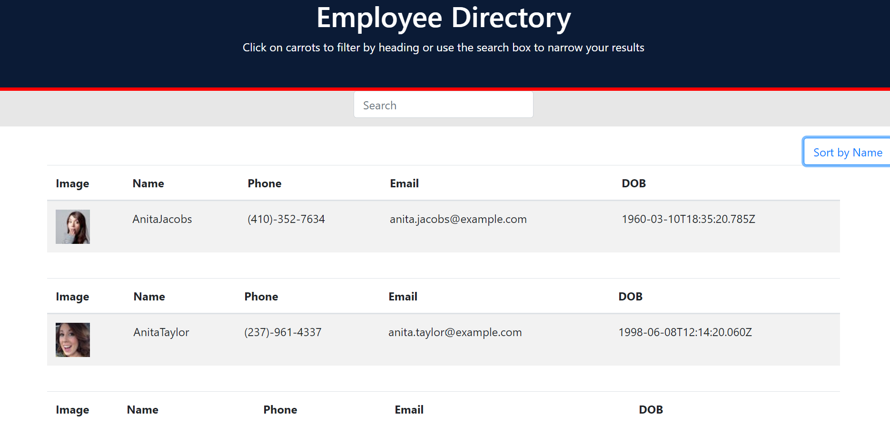

# Employee Directory 

## DESCRIPTION

This application is great for employers who need to sort and search through a list of their employees! It is currently made with an employee generator, but in the future we may be able to incorporate an adding function so that one can add their actual employees instead!

This project was made with React and was very difficult to accomplish, but I am proud to have done so and feel like this homework helped me understand React more!

## TABLE OF CONTENTS

\*[Usage](#Usage)

\*[License](#License)

\*[Contributing](#Contributing)

\*[Questions](#Questions)

## LAYOUT

Official site: https://jamjon94.github.io/employee-dir/

Here's what the application looks like!

## INSTALLATION

All you need to do to use this application is type in the site's directory or find it on my GitHub, linked below!

## USAGE

The application is made to search and sort a list of employees.

## LICENSE

This application is licensed under the MIT license.

Find out more about the license here:

(https://opensource.org/licenses/MIT)

## CONTRIBUTING

I want to thank the other classmates from the Boot Camp who come together to work as a team, answer questions anyone has, and helps however they could!

## QUESTIONS

For any questions, contact me:

Github: https://www.github.com/jamjon94

email: jamie.mar.jones14@gmail.com
